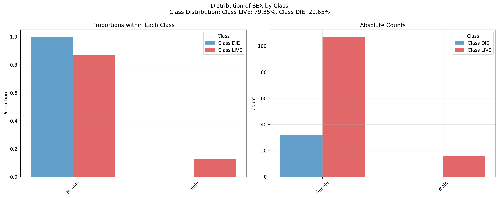
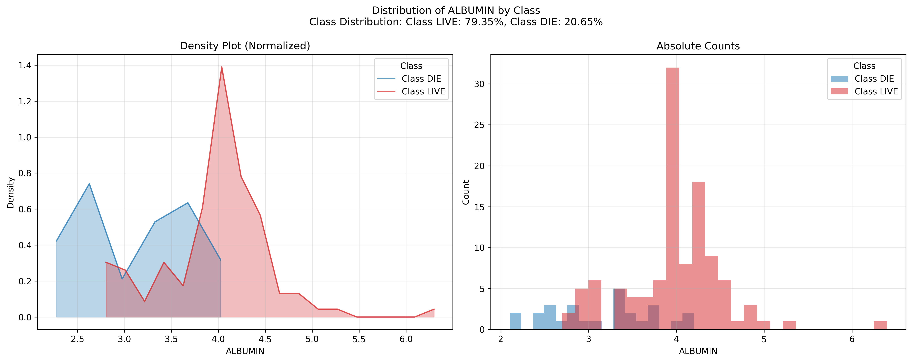

### Introduction to Hepatitis and Dataset Overview

Hepatitis is an inflammatory condition of the liver, often caused by viral infections, autoimmune conditions, or toxins such as alcohol and drugs. Inflammation due to hepatitis can impair liver function, potentially leading to severe complications, including liver failure, cirrhosis, or liver cancer if untreated. Hepatitis types A, B, C, D, and E vary in their transmission routes and severity, but all impact liver health (Source: [CDC](https://www.cdc.gov/hepatitis/index.htm)).

The provided dataset focuses on characteristics relevant to hepatitis prognosis (the predicted outcome of a disease given the state and characteristics of a patient), classifying patients into those who survived ("LIVE") or succumbed to the disease ("DIE"). Below is a breakdown of the dataset attributes, grouped by type to highlight their roles in assessing hepatitis:

#### Demographic and Basic Information
- **AGE**: Patient's age, ranging from 10 to 80 years.
- **SEX**: Gender, which may influence disease susceptibility and progression.

#### Symptom-Related Features
- **FATIGUE**, **MALAISE (feeling unwell)**, **ANOREXIA**: Common symptoms associated with hepatitis, which can signal disease progression and impact on general health.

#### Physical Examination Attributes
- **LIVER_BIG**, **LIVER_FIRM**: Physical indications of liver enlargement and firmness, often found in patients with advanced hepatitis.
- **SPLEEN_PALPABLE**: Detectable spleen enlargement, which may indicate advanced liver disease.
- **SPIDERS**: Presence of spider angiomas, small dilated blood vessels often associated with liver disease.
- **ASCITES**: Accumulation of fluid in the abdomen, a sign of severe liver impairment.
- **VARICES**: Enlarged veins in the digestive tract, which can develop in advanced liver disease due to increased pressure in the liver.

#### Laboratory Test Results
- **BILIRUBIN**: A liver function marker, where elevated levels indicate impaired liver processing of bilirubin.
- **ALK_PHOSPHATE**: Elevated levels of this enzyme can signal liver damage or blockage of bile flow.
- **SGOT**: Also known as AST, this enzyme is released with liver damage.
- **ALBUMIN**: Low levels may indicate poor liver function or malnutrition.
- **PROTIME**: Measures blood clotting time; impaired liver function often prolongs clotting.

#### Treatment and History Indicators
- **STEROID**, **ANTIVIRALS**: Treatment options that may impact patient outcomes.
- **HISTOLOGY**: Indicates whether a histological examination (microscopic examination of liver tissue) was performed, providing a more direct assessment of liver damage.

#### Target Class
- **Class**: Patient outcome, with two categories: "LIVE" or "DIE," representing survival status.

### Descriptive Statistics of the dataset

# Class Distribution

We can observe that the dataset is very unbalanced towards the LIVE class

| Class   |   Count |
|---------|---------|
| LIVE    |     123 |
| DIE     |      32 |

**Numerical Columns**:

AGE, BILIRUBIN, ALK_PHOSPHATE, SGOT, ALBUMIN, PROTIME

**Categorical Columns**:

SEX, STEROID, ANTIVIRALS, FATIGUE, MALAISE, ANOREXIA, LIVER_BIG, LIVER_FIRM, SPLEEN_PALPABLE, SPIDERS, ASCITES, VARICES, HISTOLOGY, Class

The dataset contains 155 samples, here is the pandas description of the numerical columns of the dataset, 
and below are the missing values count:

|       |      AGE |   BILIRUBIN |   ALK_PHOSPHATE |     SGOT |    ALBUMIN |   PROTIME |
|-------|----------|-------------|-----------------|----------|------------|-----------|
| count | 155      |   149       |        126      | 151      | 139        |   88      |
| mean  |  41.2    |     1.42752 |        105.325  |  85.894  |   3.81727  |   61.8523 |
| std   |  12.5659 |     1.21215 |         51.5081 |  89.6509 |   0.651523 |   22.8752 |
| min   |   7      |     0.3     |         26      |  14      |   2.1      |    0      |
| 25%   |  32      |     0.7     |         74.25   |  31.5    |   3.4      |   46      |
| 50%   |  39      |     1       |         85      |  58      |   4        |   61      |
| 75%   |  50      |     1.5     |        132.25   | 100.5    |   4.2      |   76.25   |
| max   |  78      |     8       |        295      | 648      |   6.4      |  100      |

### Missing Values Count

There are a few features with a good proportion of the data missing, in the case of the protime
feature, almost half of the values are missing, in this case it is better to remove the feature,
for the rest of features, we have used the median value for numerical features and the mode 
for categorical features

|                 |   Missing Values Count |
|-----------------|------------------------|
| STEROID         |                      1 |
| FATIGUE         |                      1 |
| MALAISE         |                      1 |
| ANOREXIA        |                      1 |
| SGOT            |                      4 |
| SPIDERS         |                      5 |
| ASCITES         |                      5 |
| SPLEEN_PALPABLE |                      5 |
| VARICES         |                      5 |
| BILIRUBIN       |                      6 |
| LIVER_BIG       |                     10 |
| LIVER_FIRM      |                     11 |
| ALBUMIN         |                     16 |
| ALK_PHOSPHATE   |                     29 |
| PROTIME         |                     67 |

## Feature distribution by class

We generate plots to analyse how the classes (LIVE and DIE) are distributed for all the features 
in the dataset, each figure (saved in the plots_and_tables/feature_distributions folder) represents 
the distribution normalized taking into account the class imbalance (left plot) and with the absolute
values (right plot).

Analyzing the figures we can see there are certain features that have a clear separation in the 
classes, some examples are:

### Sex distribution

This plot shows that in this dataset all the patients that died were females:

### Albumin distribution

This plot shows that all patients that died had an albumin value lower than 0.4:

## Preprocessing methods

### For categorical features

Since all categorical features only have two types, they are encoded with ones and zeros using LabelEncoder

### For numerical features

Numerical features can be normalized using robustScaler or minMaxScaler